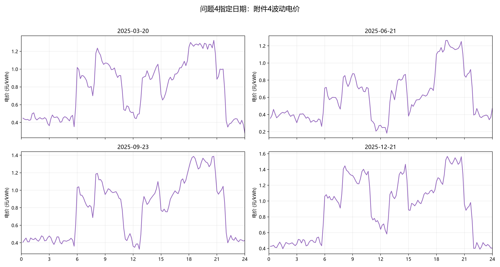
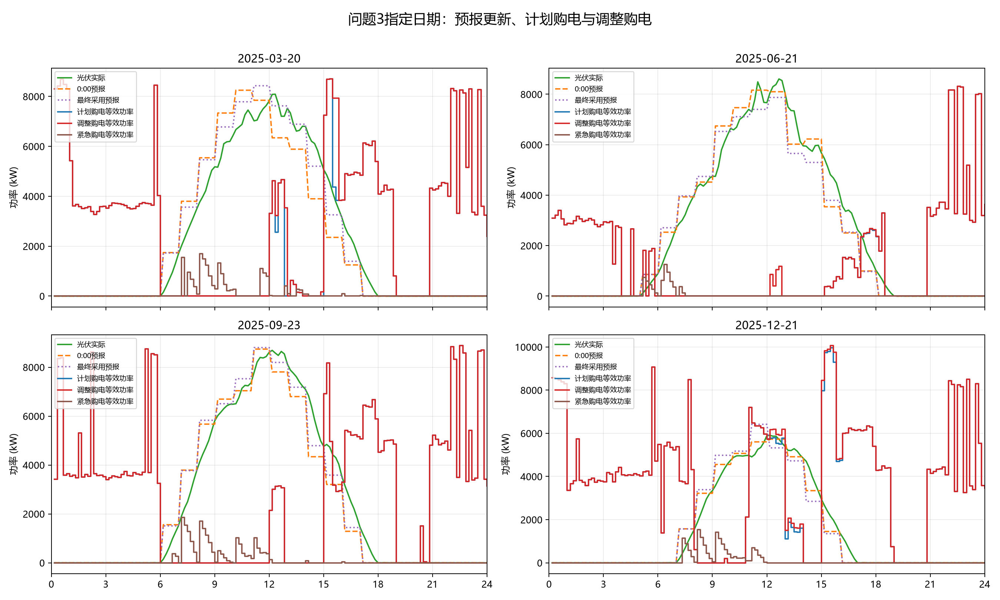
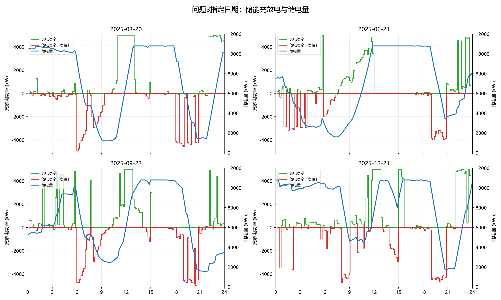
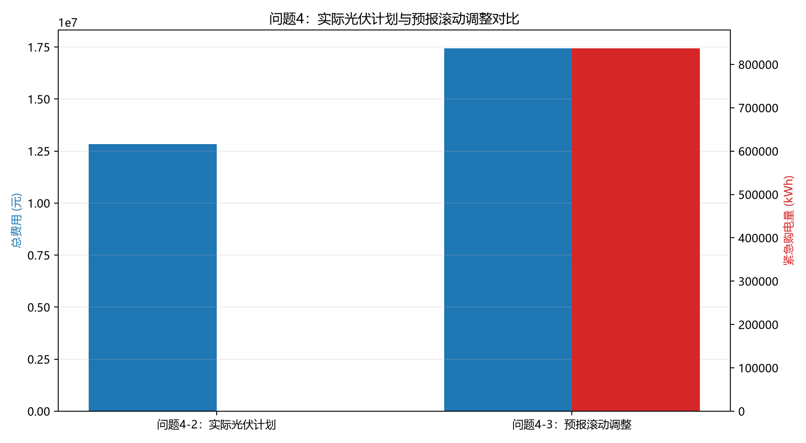

# 4 问题四：波动电价下微网购电模型的建立与求解

## 4.1 数据分析与处理

### 4.1.1 数据分析

附件4实时电价具有显著的时段波动与峰谷差异，说明固定电价假设不足以完整反映问题四的成本结构。图4-1显示，2025-03-20、2025-06-21、2025-09-23、2025-12-21四个指定日期的电价曲线均随10分钟时段变化，购电与储能决策需要同时利用价格水平和价格时序信息。

典型日期数据表明，负荷与光伏存在明显的季节性差异。2025-06-21的小区负载电量为 \(81408.064800\) kWh、光伏实际电量为 \(62073.324400\) kWh；2025-12-21的相应数值分别为 \(124376.440967\) kWh和 \(35338.659100\) kWh。该差异表明，购电计划必须与负荷、光伏及实时电价联合建模。

### 4.1.2 数据处理

1. 数据口径统一用于保证模型输入一致。分别对齐附件2的负荷与光伏、附件3的光伏预报和附件4的实时电价，并以2025-02-01至2025-12-31共334天、每天144个时段为正式样本。

2. 功率电量换算是消除量纲差异的基础。令 \(\Delta t=10/60=1/6\) h，并按

\[
L_{d,t}=P^{L}_{d,t}\Delta t,\qquad
W_{d,t}=P^{W}_{d,t}\Delta t
\]

计算时段电量；其中 \(P^{L}_{d,t}\)、\(P^{W}_{d,t}\) 分别为负荷和光伏功率，\(L_{d,t}\)、\(W_{d,t}\) 为对应电量。该式保证能量平衡和费用计算的单位均为kWh。

3. 储能参数校验用于限定可行运行域。容量、储电量范围、最大充放电功率和效率分别取 \(12000\) kWh、\([1200,10800]\) kWh、\(5000\) kW和 \(0.9\)，初始储电量为 \(6000\) kWh，对应单时段最大充放电电量为 \(M=5000/6=833.333333\) kWh。

4. 跨日连续处理用于避免每日重置储能状态。每天0:00的储电量由前一日24:00实际储电量传递，记为 \(E_{d,0}=E_{d-1,144}\)，从而保证全年储能轨迹连续。

5. 信息隔离处理用于保证策略具备可执行性。制定计划和调整计划时仅使用当时已获得的数据，未来实时电价不得提前进入决策模型，最终结算才使用附件4的真实价格。

## 4.2 模型建立

### 4.2.1 模型简介

本文构建联合情景驱动的两阶段滚动随机优化模型。问题4-2在0:00确定所有情景共享的计划购电量 \(g_t\)，随后逐10分钟根据实际负荷、光伏和实时电价执行储能；问题4-3在此基础上，于6:00、12:00、18:00只更新未来未执行时段的最终购电量 \(q_t\)。

### 4.2.2 建模步骤

1. 联合情景构造用于刻画负荷、光伏和电价之间的相关性。设 \(\omega\) 为情景，按同一历史日期 \(\tau\) 配对生成

\[
\left(L_{d,t}^{\omega},W_{d,t}^{\omega},\pi_{d,t}^{\omega}\right)
=
\left(
\widehat L_{d,t}+\varepsilon_{\tau,t}^{L},
\widehat W_{d,t}+\varepsilon_{\tau,t}^{W},
\pi_{\tau,t}
\right).
\]

其中 \(\widehat L_{d,t}\)、\(\widehat W_{d,t}\) 为基础预测，\(\varepsilon_{\tau,t}^{L}\)、\(\varepsilon_{\tau,t}^{W}\) 为历史误差，\(\pi_{\tau,t}\) 为历史实际电价。该式保留了负荷、光伏和价格在第 \(\tau\) 日的联合关系。

2. 价格更新情景用于反映日内已观察价格。对更新时点 \(s\in\{0,6,12,18\}\) 后的时段 \(t>s\)，构造

\[
\pi_{d,t}^{\omega}
=
\pi_{d,s}^{\mathrm{actual}}
+
\left(\pi_{\tau,t}-\pi_{\tau,s}\right).
\]

其中 \(\pi_{d,s}^{\mathrm{actual}}\) 为当天截至 \(s\) 的实际价格。该式只在更新时点使用已观察信息，并对未来价格进行历史增量外推。

3. 0:00计划阶段以期望费用最小为目标。目标函数为

\[
\min
\sum_{t=1}^{144}\bar\pi_t g_t
+
\sum_{\omega}p_{\omega}
\sum_{t=1}^{144}5\pi_{t,\omega}e_{t,\omega}
-
\lambda\sum_{\omega}p_{\omega}E_{T,\omega},
\qquad
\bar\pi_t=\sum_{\omega}p_{\omega}\pi_{t,\omega}.
\]

其中 \(e_{t,\omega}\) 为紧急购电量，\(E_{T,\omega}\) 为日末储电量，\(5\) 为紧急购电价格倍数，\(\lambda\) 为终端库存价值系数。该目标兼顾计划购电的期望成本、紧急购电风险和日末储能价值。

4. 供电平衡约束用于保证各情景均能满足负荷。其表达式为

\[
g_t+W_{t,\omega}+d_{t,\omega}+e_{t,\omega}
=
L_{t,\omega}+c_{t,\omega}+s_{t,\omega},
\]

其中 \(d_{t,\omega}\)、\(c_{t,\omega}\)、\(s_{t,\omega}\) 分别为放电量、充电量和弃光电量。该式是模型需满足的物理平衡条件。

5. 储能递推与边界约束用于描述充放电效率和安全运行。其表达式为

\[
E_{t,\omega}
=
E_{t-1,\omega}
+\eta c_{t,\omega}
-\frac{d_{t,\omega}}{\eta},
\]

\[
1200\le E_{t,\omega}\le10800,\qquad
0\le c_{t,\omega},d_{t,\omega}\le833.333333,
\qquad
c_{t,\omega}+d_{t,\omega}\le833.333333.
\]

其中 \(\eta=0.9\)。该组约束保证充放电功率、储电量上下限及同时充放电互斥条件均成立。

6. 滚动调整阶段用于修正未来购电计划。定义 \(\Delta_t^+=\max(q_t-g_t,0)\)、\(\Delta_t^-=\max(g_t-q_t,0)\)，调整目标为

\[
\min
\sum_{t\in\mathcal B_s}
\bar\pi_{t|s}
\left(1.5\Delta_t^++0.5\Delta_t^-\right)
+
\sum_{\omega}p_{\omega}
\sum_{t\in\mathcal B_s}5\pi_{t,\omega}e_{t,\omega}
-
\lambda\sum_{\omega}p_{\omega}E_{|\mathcal B_s|,\omega}.
\]

其中 \(\mathcal B_s\) 为当前时点后尚未执行的时段集合，调整阶段以当前实际SOC为初值。上调购电按实时价格的1.5倍计费，下调部分按0.5倍计费，该式刻画了滚动调整的违约与补偿费用。

7. 实时执行阶段用于在固定购电量后决定储能动作。净缺口为 \(R_t=L_t^{\mathrm{actual}}-W_t^{\mathrm{actual}}-q_t\)，储能动作按当前实际价格和未来价值函数确定：

\[
V_t(E)=\min_{c,d}\mathbb E_{\omega}
\left[
5\pi_{t,\omega}(R_{t,\omega}-d)^+
+V_{t+1}\left(E+\eta c-\frac d\eta\right)
\right],
\qquad V_{T+1}(E)=-\lambda E.
\]

其中 \((x)^+=\max(x,0)\)。该式体现了当前放电节省紧急购电费用与未来储能机会成本之间的权衡。

8. 实际结算公式用于统一优化目标与最终费用口径。问题4-2和问题4-3的费用分别为

\[
K_{4\text{-}2}=\sum_t\pi_t^{\mathrm{actual}}g_t
+5\sum_t\pi_t^{\mathrm{actual}}e_t,
\]

\[
K_{4\text{-}3}=\sum_t\pi_t^{\mathrm{actual}}g_t
+\sum_t\pi_t^{\mathrm{actual}}
\left(1.5\Delta_t^++0.5\Delta_t^-\right)
+5\sum_t\pi_t^{\mathrm{actual}}e_t.
\]

两式均使用附件4的实际实时电价，能够反映计划购电、调整购电和紧急购电的真实经济成本。

## 4.3 模型求解与结果分析

### 4.3.1 求解流程

模型采用逐日滚动方式求解。每天依次完成联合情景构造、0:00线性规划、更新时点调整、10分钟实时储能执行和日末SOC传递，最终依据附件4实际价格结算。图4-2与图4-3分别展示预报更新、购电调整以及储能充放电和储电量变化，说明滚动策略能够随新信息调整未来动作。

### 4.3.2 结果展示

全年求解结果稳定，并满足供电平衡与储能安全约束。主要结果如表4-1所示。

表4-1 全年结果汇总

| 指标 | 问题4-2 | 问题4-3 |
|---|---:|---:|
| 计划购电量/kWh | 21084870.830584 | 21059204.845156 |
| 调整购电量/kWh |  | 21277381.128315 |
| 紧急购电量/kWh | 198238.462926 | 40104.456175 |
| 总费用/元 | 15127992.554408 | 14491465.265148 |

问题4-3在保留0:00计划的基础上进行滚动调整，其结果优于问题4-2。问题4-3总费用为14491465.265148元，低于问题4-2的15127992.554408元；紧急购电量由198238.462926 kWh降至40104.456175 kWh，说明预报更新与未来时段调整能够降低实时偏差对系统的冲击。

与固定电价模型相比，波动电价主要提高购电成本而未显著扩大供能缺口。问题4-2总费用较问题2增加810826.072716元，增幅5.663314%；问题4-3总费用较问题3增加755133.183440元，增幅5.497342%。该结果表明，成本上升主要来自实时电价水平和峰谷价差，而非额外负荷缺口。

储能运行结果符合低价充电、高价放电的经济规律。问题4-2的充电、放电加权电价分别为0.523683、1.107678元/kWh，低价充电量占比为46.657786%，高价放电量占比为67.319532%；问题4-3的对应值为0.522817、1.108270元/kWh、46.826114%和67.829966%。上述统计量表明储能能够在价格较低时段充入电量，并在价格较高时段释放电量。

### 4.3.3 结果分析与检验

模型校验结果表明所求解满足全部关键约束。最大SOC递推残差和最大电能平衡残差均为0 kWh，最大跨日SOC断点为0 kWh，最大充放电功率为5000 kW，说明能量守恒、储能连续性和功率上限均得到满足。

灵敏度结果表明模型对预报和价格尺度变化具有连续响应。预报和电价缩放比例由0.9变化至1.1时，总费用总体随之变化，且电价尺度变化对结算费用的影响近似成比例，说明模型未出现异常跳变。
